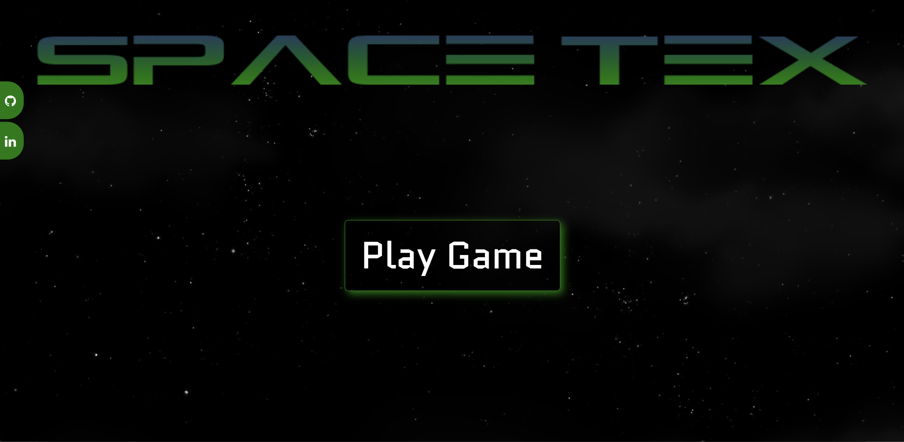

# SpaceTex 
SpaceTex is a JavaScript typing game for the math language TeX. With a dynamic space theme, the goal is to destroy as many asteroids, that contain the TeX math symbols, as possible. It was created using pure JavaScript, HTML, and CSS. The animations come from the native ``` requestAnimationFrame ``` method as well as regular HTML DOM manipulation. 

**[Visit the Live Application](https://jtee2000.github.io/spaceTeX.github.io/)**


## Technologies 
* JavaScript
* Webpack 
* MathQuil API
* HTML5 Canvas
* CSS


